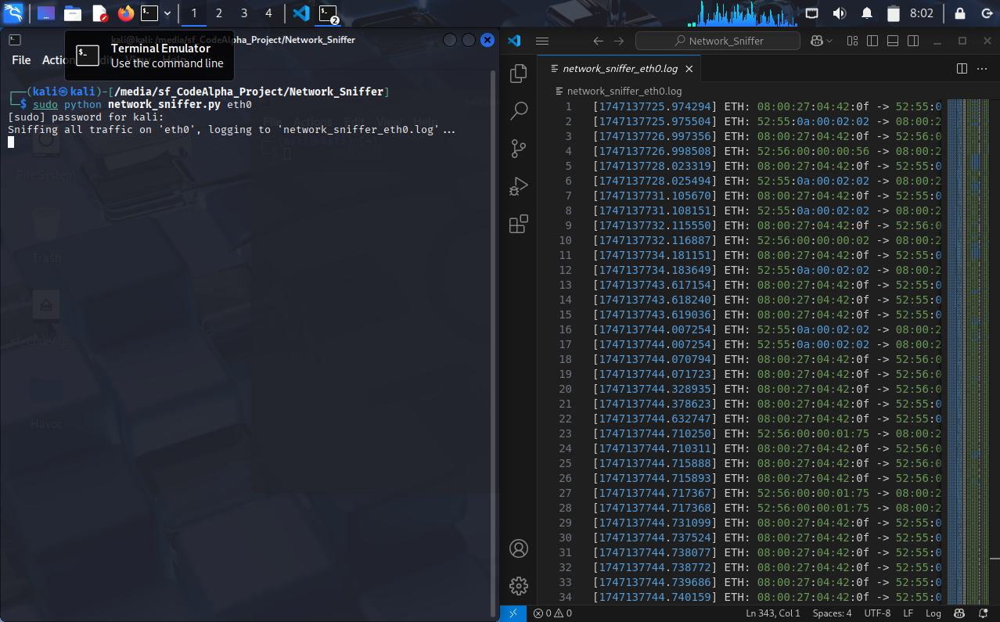

# Network-Sniffer-Python

interneship projects for CodeAlpha



# Network Packet Sniffer - CodeAlpha Internship Task

This README file provides instructions on how to use the Python script `network_sniffer.py`. This script is a basic network packet sniffer designed to capture and log network traffic on a specified interface. This project was completed as part of my internship at CodeAlpha.

## How to Use the Script

Follow these steps to run the `network_sniffer.py` script:

1.  **Ensure Prerequisites are Met:**

    - **Python Installed:** Make sure you have Python 3 installed on your system. You can verify this by opening your terminal or command prompt and running:
      ```bash
      python --version
      ```
      or
      ```bash
      python3 --version
      ```
    - **`scapy` Library Installed:** The script requires the `scapy` library. If you haven't installed it, open your terminal or command prompt and run:
      ```bash
      pip install scapy
      ```
      You might need to use `sudo` on some systems:
      ```bash
      sudo pip install scapy
      ```

2.  **Save the Script:** Save the provided Python code into a file named `network_sniffer.py` on your computer. Choose a directory where you can easily access it via the terminal.

3.  **Open Your Terminal or Command Prompt:** Navigate to the directory where you saved the `network_sniffer.py` file using the `cd` command. For example:

    ```bash
    cd Downloads
    ```

4.  **Identify Your Network Interface:** You need to know the name of the network interface you want to monitor. Common names include `eth0`, `wlan0` (Linux), `Ethernet`, or `Wi-Fi` (Windows).

    - **Linux:** Use `ip a` or `ifconfig -a` to list available interfaces.
    - **Windows:** Use `ipconfig /all` and look for the name of your active network connection.

5.  **Execute the Script:** Run the `network_sniffer.py` script from your terminal or command prompt, providing the network interface name as a command-line argument. **You will likely need administrator or root privileges to run this script.**

    - **Linux/macOS:**

      ```bash
      sudo python network_sniffer.py <your_interface_name>
      ```

      Replace `<your_interface_name>` with the actual name of your network interface (e.g., `eth0`, `wlan0`).

    - **Windows (Run Command Prompt or PowerShell as Administrator):**
      ```bash
      python network_sniffer.py <Your Interface Name>
      ```
      Replace `<Your Interface Name>` with the actual name of your network interface (e.g., `Ethernet`, `Wi-Fi`).

6.  **Observe the Sniffing Process:** Once the script starts, it will display a message indicating that it's capturing traffic on the specified interface and logging the information to a file.

7.  **Stop the Sniffing:** To stop the packet capture, press `Ctrl + C` in your terminal or command prompt. The script will then print a message confirming that the sniffing has been terminated.

8.  **View the Log File:** After stopping the script, a log file will be created in the same directory where you ran the script. The file will be named `network_sniffer_<your_interface_name>.log` (e.g., `network_sniffer_eth0.log`). You can open this file with any text editor to examine the captured network traffic details. Each line in the log file represents a captured packet, including its timestamp, source and destination MAC addresses, IP addresses, protocol, and port numbers (if applicable).

**Example:**

To monitor the Wi-Fi interface named `wlan0` on a Linux system, you would execute:

```bash
sudo python network_sniffer.py wlan0

** A log file named network_sniffer_wlan0.log will be created with the captured data **
```
